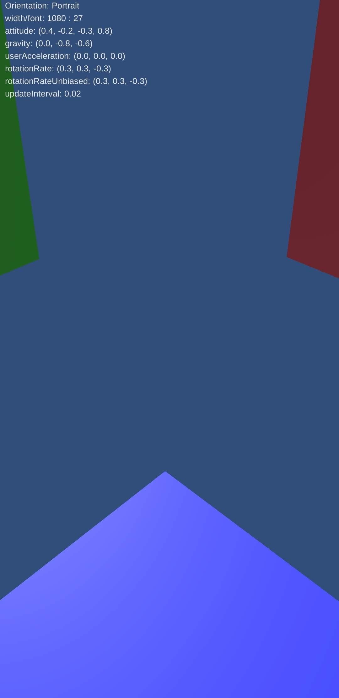

# GyroCube
Shows a cube around the viewer that moves by the gyro

Created from this example (with some changes):

https://docs.unity3d.com/ScriptReference/Gyroscope.html

Download apk from: https://github.com/erasta/GyroCube/releases/latest

<table>
  <tr>
    <td>
Looking up:
    </td>
    <td>
Looking down:
    </td>
  </tr>
  <tr>
    <td>
</img>
    </td>
    <td>
</img>
    </td>
  </tr>
</table>
